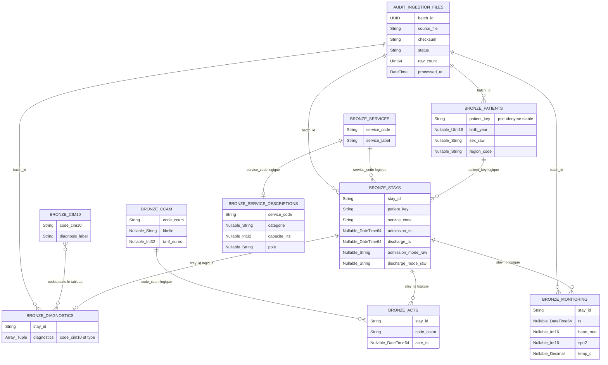

# Modèle de données — couche Bronze

## 1. À quoi sert Bronze ?

Bronze est la **zone d'atterrissage typée** de l'entrepôt. Elle répond principalement à quatre questions :

1. Qu'est-ce qui a été reçu ?
2. De quel fichier vient chaque ligne ?
3. Quand le fichier a-t-il été traité ?
4. Peut-on rejouer les transformations vers Silver ?

La règle importante est :

> Bronze conserve les données détaillées telles qu'elles arrivent, avec des types et de la traçabilité. Silver décide ensuite ce qui est valide, déduplique et réalise les jointures.

Bronze n'est donc pas encore un schéma en étoile. Les noms `dim_*` et `fact_*` apparaissent en Silver, lorsque les données deviennent analytiques.

## 2. Vue générale



Les relations du diagramme sont **logiques** : ClickHouse ne doit pas bloquer le chargement Bronze à cause d'une clé étrangère inconnue. Les contrôles de cohérence sont réalisés lors du passage vers Silver.

## 3. Colonnes communes

Chaque table Bronze reçoit les colonnes techniques suivantes :

| Colonne             | Rôle                                               |
| ------------------- | -------------------------------------------------- |
| `batch_id`          | Identifie l'exécution d'ingestion                  |
| `source_file`       | Chemin du fichier d'origine                        |
| `source_date`       | Date du dossier de dépôt quotidien                 |
| `source_row_number` | Position de la ligne ou de l'objet dans le fichier |
| `ingested_at`       | Horodatage du chargement Bronze                    |

Exemple :

```text
stay_id          = S00000123
source_file      = sejours/2026-08-26/sejours.csv
source_row_number = 418
batch_id         = 32f6...a91
```

Si cette ligne est rejetée en Silver, ces informations permettent de retrouver précisément son origine sans recopier de donnée identifiante dans le journal d'erreur.

## 4. Grain et rôle des tables

| Table                   | Grain Bronze                                     | Ce qui est conservé                                         |
| ----------------------- | ------------------------------------------------ | ----------------------------------------------------------- |
| `bronze.patients`       | Une ligne par ligne du fichier patient quotidien | Les retours quotidiens, même si le patient est déjà présent |
| `bronze.stays`          | Une ligne par ligne du CSV des séjours           | Les séjours valides et invalides                            |
| `bronze.diagnostics`    | Un objet JSON par séjour                         | Le tableau `diagnostics` encore imbriqué                    |
| `bronze.monitoring`     | Une ligne par relevé Parquet                     | Les constantes, même hors plage                             |
| `bronze.services`       | Une ligne par ligne du référentiel service       | Le code et le libellé source                                |
| `bronze.cim10`          | Une ligne par ligne du référentiel CIM-10        | Le code et le libellé source                                |
| `bronze.service_descriptions` | Une ligne par description de service       | Catégorie, capacité en lits et pôle, même incomplets        |
| `bronze.ccam`           | Une ligne par code du référentiel CCAM            | Le code, le libellé et le tarif source                      |
| `bronze.acts`           | Une ligne par acte du fichier Parquet             | Le séjour, le code CCAM et l'horodatage                     |
| `audit.ingestion_files` | Une ligne par fichier traité                     | Le statut de l'ingestion et son empreinte                   |

## 5. Pourquoi les colonnes sont `Nullable` ?

Une valeur invalide ne doit pas empêcher tout le fichier d'être chargé.

Exemple source :

```text
admission_ts = "date-inconnue"
```

Lors du typage Bronze, `parseDateTime64BestEffortOrNull` produit :

```text
admission_ts = NULL
```

La ligne reste dans Bronze avec son fichier et son numéro de ligne. Silver détecte ensuite que l'admission est absente et écrit un rejet traçable.

Cette séparation évite qu'une seule mauvaise ligne bloque les 4 999 autres lignes valides du fichier.

## 6. Pourquoi garder les valeurs anormales en Bronze ?

Le sujet donne les bornes suivantes :

```text
heart_rate : 20 à 250 bpm
spo2       : 50 à 100 %
temp_c     : 30 à 45 °C
```

Si la source contient :

```text
heart_rate = 500
spo2       = 120
```

Bronze conserve la ligne. Silver l'écarte ensuite avec une règle explicite :

```text
MONITORING_HEART_RATE_OUT_OF_RANGE
MONITORING_SPO2_OUT_OF_RANGE
```

Si Bronze supprimait directement cette ligne, il deviendrait difficile de prouver pourquoi le nombre de lignes source et le nombre de lignes Silver sont différents.

## 7. L'exception RGPD

Bronze est proche de la source, mais elle ne doit jamais contenir l'identité réelle du patient.

Avant l'entrée dans l'entrepôt :

```text
patient_id → pseudonyme stable patient_key
birth_date → birth_year
nom        → supprimé
prenom     → supprimé
nir        → supprimé
```

Exemple :

```text
Source CHU
IPP0001234 | DUPONT | Alice | 2 99... | 1985-03-12

Bronze
8f4b...92cd | 1985 | F | 94
```

Le pseudonyme doit être produit avec un HMAC ou un hachage déterministe utilisant un secret, afin que le même patient obtienne toujours la même clé sans permettre de retrouver son IPP.

## 8. Pourquoi le JSON diagnostic reste imbriqué ?

La source contient :

```json
{
  "stay_id": "S001",
  "diagnostics": [
    { "code_cim10": "I21", "type": "principal" },
    { "code_cim10": "E11", "type": "associe" }
  ]
}
```

Bronze conserve cette structure sous la forme d'un tableau typé :

```text
Array(Tuple(code_cim10 String, diagnosis_type String))
```

Silver utilise ensuite `arrayJoin` pour produire :

```text
S001 | I21 | principal
S001 | E11 | associe
```

Cela respecte la séparation des responsabilités : Bronze structure la source, Silver la transforme pour l'analyse.

## 9. Comment assurer l'incrémental ?

La table `audit.ingestion_files` mémorise chaque fichier :

```text
source_file | checksum | status | batch_id | row_count
```

Avant un chargement :

1. Calculer l'empreinte SHA-256 du fichier.
2. Vérifier si le couple `(source_file, checksum)` possède déjà le statut `SUCCESS`.
3. S'il existe, ignorer le fichier.
4. Sinon, créer un nouveau `batch_id` et le charger.

Exemple :

```text
patients/2026-08-26/patients.csv + abc123 + SUCCESS
```

Un second lancement voit la même empreinte et ne recharge pas les 6 000 lignes. Le pipeline devient rejouable sans créer de doublons techniques.

## 10. De Bronze vers Silver

| Bronze                                       | Traitement Silver                              | Silver                         |
| -------------------------------------------- | ---------------------------------------------- | ------------------------------ |
| Plusieurs versions quotidiennes d'un patient | Garder la plus récente                         | `dim_patient`                  |
| Séjours valides et invalides                 | Contrôler les dates et les champs obligatoires | `fact_stay` + rejets           |
| Diagnostics sous forme de tableau            | Aplatir et contrôler CIM-10                    | `fact_diagnosis`               |
| Toutes les constantes                        | Appliquer les bornes physiologiques            | `fact_monitoring` + rejets     |
| Référentiels bruts                           | Dédupliquer codes et libellés                  | `dim_service`, `dim_diagnosis` |
| Description des services                     | Enrichir sans supprimer les services absents   | `dim_service`                  |
| Référentiel CCAM                             | Contrôler code, libellé et tarif               | `dim_ccam`                     |
| Actes médicaux                               | Contrôler les clés et récupérer le service     | `fact_acte`                    |

Le résumé à retenir est :

```text
Bronze = ce qui a été reçu, typé et traçable
Silver = ce qui est fiable, cohérent et utilisable
Gold   = ce qui est calculé pour les dashboards
```

## 11. Choix ClickHouse conseillés

- Utiliser `MergeTree` pour les tables Bronze.
- Ne pas partitionner les petites tables patient, séjour et référentiels sans besoin mesuré.
- Pour `bronze.monitoring`, partitionner par mois de `source_date`, pas par jour, afin d'éviter trop de petites partitions.
- Utiliser un ordre comme `(source_date, stay_id, ts)` pour le monitoring.
- Ne pas utiliser `FINAL` ou des jointures complexes en Bronze : les transformations appartiennent à Silver.
