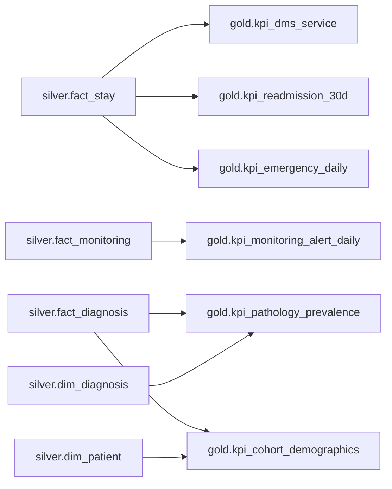

# Modèle de données — couche Gold et KPI

## 1. À quoi sert Gold ?

Silver contient le détail nettoyé. Gold contient de petites tables déjà
calculées pour Metabase : **une table Gold correspond à un KPI du sujet**.

```text
Silver = une ligne par séjour, diagnostic ou relevé
Gold   = une ligne par service, jour, pathologie ou cohorte
```

## 2. Origine des six KPI



| Table Gold                   | Une ligne représente                         |
| ---------------------------- | -------------------------------------------- |
| `kpi_dms_service`            | un service                                   |
| `kpi_readmission_30d`        | le résultat global                           |
| `kpi_emergency_daily`        | un jour d'admission aux urgences             |
| `kpi_monitoring_alert_daily` | un jour de surveillance                      |
| `kpi_pathology_prevalence`   | une pathologie CIM-10                        |
| `kpi_cohort_demographics`    | une pathologie, une tranche d'âge et un sexe |

## 3. DMS par service

Le corrigé demande bien une **DMS par service** et uniquement sur les séjours
clos. Un séjour encore en cours n'a pas de durée finale et n'entre donc pas dans
la moyenne.

```text
DMS en heures = somme des durées / nombre de séjours clos
DMS en jours  = DMS en heures / 24
```

Exemples vérifiés : Réanimation `9,05 jours`, Cardiologie `5,31 jours`,
Urgences `2,15 jours`. Les huit services correspondent exactement au corrigé.

## 4. Réadmission à 30 jours

Les séjours d'un patient sont triés par date. Un séjour clos compte comme une
réadmission si l'admission suivante arrive après sa sortie et au plus 30 jours
plus tard.

```text
taux = 780 réadmissions / 6 729 séjours Silver × 100 = 11,59 %
```

Le numérateur nécessite une sortie, mais le dénominateur demandé par le corrigé
est bien l'ensemble des 6 729 séjours valides, y compris ceux encore en cours.

## 5. Activité des urgences

Ici, « urgences » désigne le **service** `URGENCES`. Ce n'est pas la même chose
que `admission_mode = 'urgence'`, qui peut exister dans d'autres services.

Pour chaque date d'admission, la table calcule :

- le nombre de passages dans le service ;
- le nombre de séjours encore présents, donc sans date de sortie ;
- la durée moyenne en heures des séjours clos de ce groupe.

La table contient 28 jours. Par exemple, le 1er août : `46` passages, `0`
encore présent et `47,6 h` de durée moyenne.

## 6. Surveillance des constantes

Un relevé est une alerte si **au moins une** condition du corrigé est vraie :

```text
SpO2 < 92 %
ou fréquence cardiaque < 50 ou > 100 bpm
ou température > 38,5 °C
```

Le relevé ne compte qu'une fois même si plusieurs constantes dépassent leur
seuil. Le taux journalier vaut `alert_count / measurement_count × 100`, arrondi
à une décimale. Les 30 jours, du 1er au 30 août, correspondent au corrigé.

Ces seuils servent ici à reproduire l'exercice pédagogique ; ils ne constituent
pas à eux seuls un outil de décision clinique.

## 7. Prévalence et k-anonymat

La prévalence compte les **patients distincts**, pas le nombre de diagnostics ni
le nombre de séjours. Un patient présent plusieurs fois pour N39 ne compte donc
qu'une fois.

La table conserve deux colonnes :

- `patient_count` pour contrôler le calcul en environnement restreint ;
- `publishable_patient_count` pour un dashboard diffusable.

La seconde vaut `NULL` lorsque l'effectif est inférieur à 5. On obtient par
exemple N39 = `2 234`, G12 = `8`, E84 = `4 / NULL` et Q90 = `3 / NULL`.

## 8. Cohorte âge × sexe

Ce KPI utilise uniquement `diagnosis_type = 'principal'`. L'âge est approché
avec l'année de référence 2026 et `birth_year`, puis regroupé par décennies :
`0-9`, `10-19`, ..., `90-99`.

Comme pour la prévalence, `publishable_patient_count` vaut `NULL` si la cellule
contient moins de 5 patients. Le dashboard destiné à la diffusion doit utiliser
cette colonne et non le compte brut.

## 9. Reconstruction et contrôles

Gold est entièrement dérivé de Silver et ne contient que quelques lignes. Il
est donc reconstruit à chaque exécution avec `TRUNCATE` puis `INSERT SELECT` :

```bash
python3 scripts/run_pipeline.py --step gold
```

Exemples de contrôle dans ClickHouse :

```sql
SELECT * FROM gold.kpi_dms_service
ORDER BY average_length_of_stay_days DESC;

SELECT * FROM gold.kpi_readmission_30d;

SELECT * FROM gold.kpi_monitoring_alert_daily
ORDER BY date_key;

SELECT diagnosis_code, patient_count, publishable_patient_count
FROM gold.kpi_pathology_prevalence
ORDER BY patient_count DESC;
```

Les formules sont regroupées dans
[`sql/gold/40_build_gold.sql`](../sql/gold/40_build_gold.sql).
