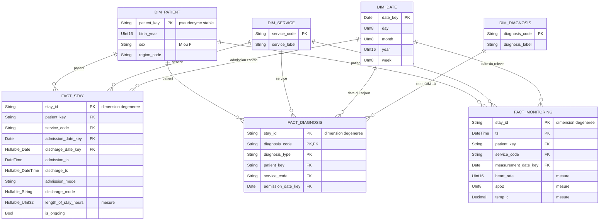

# Data model — couche Silver

➡️ [Ouvrir la version interactive](./data-model-silver-interactif.html)

## Principe retenu

Le modèle Silver est une **constellation de faits** : plusieurs tables de faits utilisent les mêmes dimensions. Cela permet d'analyser les séjours, les diagnostics et le monitoring selon les mêmes axes, sans mélanger leurs grains.

## Dimensions et faits

| Table             | Type             | Grain / rôle                                                                                          |
| ----------------- | ---------------- | ----------------------------------------------------------------------------------------------------- |
| `dim_patient`     | Dimension        | Un patient pseudonymisé ; analyse par année de naissance, sexe ou région                              |
| `dim_service`     | Dimension        | Un service hospitalier ; analyse par service                                                          |
| `dim_date`        | Dimension        | Un jour ; analyse par jour, semaine, mois ou année                                                    |
| `dim_diagnosis`   | Dimension        | Un code CIM-10 et son libellé ; analyse par pathologie                                                |
| `fact_stay`       | Fait             | Une ligne par séjour ; comptage des passages et mesure de durée                                       |
| `fact_diagnosis`  | Fait sans mesure | Une ligne par diagnostic associé à un séjour ; le nombre de lignes ou de patients donne la prévalence |
| `fact_monitoring` | Fait             | Une ligne par relevé horodaté ; mesures de fréquence cardiaque, SpO2 et température                   |

`fact_diagnosis` est un **fait sans mesure** : il représente l'événement « un diagnostic est associé à un séjour ». Il est donc comptable même s'il ne contient pas de montant ou de durée.

## Relations déduites

- Une dimension est placée du côté **1** et un fait du côté **N** : un patient, un service ou une date peut apparaître dans plusieurs événements.
- `dim_diagnosis` ne rejoint que `fact_diagnosis`, car un code CIM-10 ne décrit ni un séjour entier ni une mesure de monitoring.
- Les clés `patient_key`, `service_code` et les clés de date sont recopiées dans chaque fait pendant l'enrichissement Silver. On interroge ainsi directement une dimension et un fait, sans faire de jointure entre deux grosses tables de faits. Pour `fact_diagnosis`, la date est celle de l'admission car la source diagnostic ne fournit pas de date propre.
- `stay_id` est conservé dans les trois faits comme **dimension dégénérée** : il permet de retrouver les événements d'un séjour, mais ne nécessite pas une table de dimension séparée.

## Qualité, RGPD et traçabilité

- `dim_patient` ne contient jamais le nom, le prénom, le NIR, l'IPP en clair ou la date de naissance complète. `patient_key` est un pseudonyme déterministe et stable.
- Les patients quotidiens sont dédupliqués en gardant leur version la plus récente.
- Une sortie antérieure à l'admission est rejetée ; une sortie vide est conservée avec `is_ongoing = true`.
- Les diagnostics JSON sont aplatis avant leur chargement dans `fact_diagnosis`.
- Les relevés hors bornes sont rejetés : fréquence cardiaque 20–250, SpO2 50–100 %, température 30–45 °C.
- Chaque table reçoit `batch_id`, `source_file`, `source_date` et `processed_at`. Les rejets sont enregistrés dans une table technique `audit_quality_rejects`, séparée du modèle analytique et sans donnée identifiante.

Les agrégats comme la DMS, les réadmissions, les passages aux urgences et les cohortes restent en Gold. Le sujet ne fournit pas les seuils médicaux d'alerte du monitoring : ils doivent être validés par le métier avant de calculer cet indicateur.
