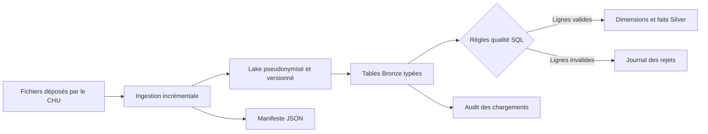

# Pipeline Lake → Bronze → Silver

## Vue simple



L'idée est de séparer les responsabilités :

- le **Lake** conserve les fichiers reçus, mais sans identité patient directe ;
- **Bronze** conserve les lignes détaillées, typées et traçables ;
- **Silver** ne garde que les données cohérentes et prêtes pour l'analyse ;
- `audit` explique ce qui a été chargé ou rejeté.

## 1. Préparer l'environnement

À la racine du projet :

```bash
python3 scripts/init_env.py
docker compose up -d
python3 scripts/run_pipeline.py
```

Le premier script crée `.env` avec une clé secrète aléatoire. Le fichier est
ignoré par Git et protégé par les permissions `0600`. La même clé doit être
conservée pour tous les dépôts : un même patient doit toujours produire le même
`patient_key`.

## 2. Copie incrémentale dans le Lake

Le script [`scripts/ingest_lake.py`](../scripts/ingest_lake.py) parcourt
`source-filestorage` en lecture seule. Pour chaque fichier, il calcule son
empreinte SHA-256 et consulte :

```text
data-lake/_state/ingestion-manifest.json
```

La clé de contrôle est le couple `(chemin source, empreinte)`. Si ce couple a
déjà le statut `SUCCESS` et que la copie est encore intacte, le fichier est
ignoré. Sinon, une nouvelle version est créée avec un nom comme :

```text
patients/2026-08-26/patients__a07805261f5d.csv
```

Le suffixe vient de l'empreinte du fichier. Une correction d'un fichier existant
produit donc une nouvelle version sans écraser l'ancienne. Les écritures sont
atomiques : un fichier temporaire est terminé avant d'être renommé.

Exemple observé au deuxième lancement :

```text
LAKE discovered=14 copied=0 skipped=14 failed=0
```

## 3. Pseudonymisation avant le Lake

Les fichiers patient et séjour sont réécrits avant leur dépôt dans le Lake.

| Source sensible | Valeur placée dans le Lake |
| --- | --- |
| `patient_id` | `patient_key = HMAC-SHA256(clé, patient_id)` |
| `birth_date` | année seule dans `birth_year` |
| `nom`, `prenom`, `nir` | colonnes supprimées |

Exemple fictif :

```text
Source : IPP0001, Dupont, Alice, 1985-03-12
Lake   : a91f...e42c, 1985, F, 94
```

Un HMAC a été choisi plutôt qu'un simple SHA-256. Sans la clé secrète, une
personne qui devine un IPP ne peut pas recalculer directement son pseudonyme.
Le script vérifie aussi que les colonnes interdites ne sont plus présentes.

Le manifeste mémorise une empreinte de la clé, jamais la clé elle-même. Le
pipeline refuse une nouvelle ingestion si la clé change accidentellement, car
cela casserait les relations entre patients et séjours.

## 4. Chargement Bronze

Les tables sont créées par [`sql/10_bronze_tables.sql`](../sql/10_bronze_tables.sql).
Le chargeur lit nativement les formats CSV, JSON et Parquet puis ajoute à chaque
ligne :

```text
source_date, source_file, source_row_number, batch_id, ingested_at
```

Ces colonnes donnent la provenance exacte d'une donnée. Les conversions
tolérantes produisent `NULL` lorsqu'une date ou une mesure est illisible. La
ligne reste ainsi disponible pour expliquer un futur rejet Silver.

`audit.ingestion_files` conserve le statut et le nombre de lignes de chaque lot.
Avant une reprise, le pipeline retire uniquement les données du `batch_id`
concerné, puis recharge ce lot. Il ne duplique donc pas un chargement partiel.

## 5. Transformations SQL Silver

Les tables Silver sont créées par
[`sql/20_silver_tables.sql`](../sql/20_silver_tables.sql). Les règles se trouvent
dans [`sql/silver`](../sql/silver) et s'exécutent dans cet ordre :

1. référentiels service et CIM-10 ;
2. patients ;
3. séjours ;
4. diagnostics ;
5. monitoring.

Cet ordre suit les dépendances. Par exemple, un séjour a besoin d'un patient et
d'un service connus. Un diagnostic ou un relevé de monitoring a ensuite besoin
d'un séjour accepté.

Quelques règles concrètes :

- une sortie antérieure à l'admission rejette le séjour ;
- une sortie renseignée sans mode de sortie rejette le séjour ;
- un diagnostic lié à un séjour rejeté est lui aussi rejeté ;
- une fréquence cardiaque doit rester entre 20 et 250 bpm ;
- un relevé doit se situer pendant le séjour.

Une ligne invalide est écrite dans `audit.quality_rejects` avec sa règle, sa clé,
son fichier et son numéro de ligne. Elle reste également en Bronze.

## 6. Volumes vérifiés

Le pipeline a été exécuté sur les 14 fichiers du sujet :

| Jeu de données | Bronze | Silver accepté | Rejeté |
| --- | ---: | ---: | ---: |
| Patients | 16 200 versions | 6 000 patients courants | 0 |
| Séjours | 15 000 | 12 889 | 2 111 |
| Diagnostics | 37 380 diagnostics imbriqués | 32 104 | 5 276 |
| Monitoring | 66 677 | 56 315 | 10 362 |
| Services | 8 | 8 | 0 |
| CIM-10 | 10 | 10 | 0 |

Pour les patients, Bronze contient les trois photographies quotidiennes. La
table `silver.dim_patient` utilise `ReplacingMergeTree` et conserve la version la
plus récente par `patient_key`. Pour compter immédiatement l'état courant :

```sql
SELECT count() FROM silver.dim_patient FINAL;
```

## 7. Contrôler l'exécution

```sql
-- Derniers chargements Bronze
SELECT source_file, target_table, status, row_count, processed_at
FROM audit.ingestion_files
ORDER BY processed_at DESC;

-- Volumes acceptés et rejetés en Silver
SELECT target_table, sum(accepted_rows), sum(rejected_rows)
FROM audit.silver_batches
WHERE status = 'SUCCESS'
GROUP BY target_table;

-- Causes des rejets
SELECT source_table, rule_code, count()
FROM audit.quality_rejects
GROUP BY source_table, rule_code
ORDER BY source_table, count() DESC;
```

## 8. Commandes utiles

```bash
# Voir ce que la copie Lake ferait, sans écrire de fichier
python3 scripts/ingest_lake.py --dry-run

# Rejouer Bronze et Silver à partir du Lake existant
python3 scripts/run_pipeline.py --skip-lake

# Rejouer seulement Silver à partir de Bronze
python3 scripts/run_pipeline.py --skip-lake --skip-bronze

# Lancer les tests de pseudonymisation et d'idempotence
python3 -m unittest discover -s tests -v
```

Les répertoires `source-filestorage`, `data-lake` et le fichier `.env` restent
locaux et sont exclus de Git. Seuls les scripts, le SQL et la documentation sont
publiés.
